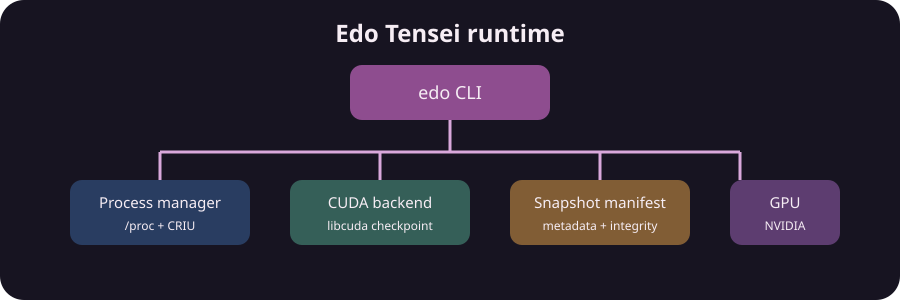
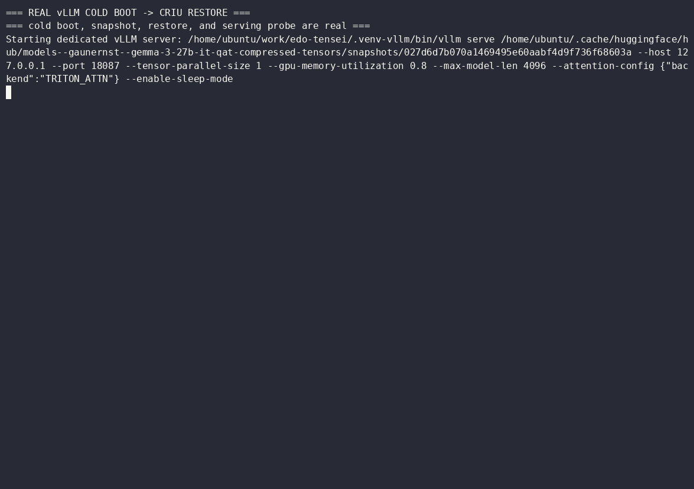
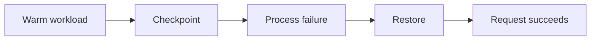

# Edo Tensei

Edo Tensei checkpoints live AI workloads and restores them with their runtime state intact — from Python processes to PyTorch and vLLM servers.

> Warm it once. Freeze it. Let it disappear. Bring it back ready to serve.



## The wow moment: restore beats cold start

These are measured runs, not promises. They are single-GPU measurements on the development H100; the Gemma run uses an allocator-enabled, KV-release snapshot.

For Gemma, the historically observed first-ever cold boot was approximately
180s when startup also paid the initial compilation/autotune/cache costs. The
104.158s value below is the reproducible warm-cache cold boot from the latest
run; it still includes model startup and multimodal warmup.

| Workload | Cold start → ready | Restore → ready | Observed improvement |
| --- | ---: | ---: | ---: |
| Stateful CPU process | 2.102 s | 0.164 s | **12.8× faster** |
| Qwen3-0.6B + vLLM | 30.046 s | 3.368 s | **8.9× faster** |
| Gemma 3 27B QAT + vLLM | 104.158 s | 11.060 s | **9.4× faster** |

### The real terminal run

Cold boot is shown on the left; Edo Tensei restores the warmed vLLM process
group on the right. The large overlays stay visible at the end of each panel
so the result is easy to verify: both paths return valid `Ready.` output.

<p align="center">
  
</p>

**Cold total to ready: 104.158s · Edo Tensei to ready: 11.060s · 9.4× faster**

```mermaid
xychart-beta
    title "Time to ready (seconds; lower is better)"
    x-axis [CPU, Qwen, Gemma]
    y-axis "seconds" 0 --> 110
    bar [2.102, 30.046, 104.158]
    bar [0.164, 3.368, 11.060]
```



The first bar in each pair is cold start; the second is restore. The Gemma result includes vLLM Sleep Mode, fresh KV-cache recreation, trusted local restore, and a 32 GiB snapshot. Exact numbers vary with the host, model, image storage, integrity verification, and runtime configuration. See the [full benchmark report](V0.1-MILESTONE.md) for scope and limitations.

## Run your first restore in 60 seconds

This CPU-only demo starts a warm stateful process, checkpoints it, removes the original process, restores it, sends another request, and records measured timings.

```bash
cargo run --example resume
```

You should see:

```text
Edo Tensei — Resume a warm workload
✓ Warm-up completed
✓ Checkpoint created
✓ Original process disappeared
✓ Restored successfully
✓ Request completed after restore
Cold start:    <measured on your host>
Restore time:  <measured on your host>
Run report:    .edo/runs/<timestamp>-resume.json
```

The first demo needs Linux, Rust, Python 3, CRIU, and permission to execute CRIU through `sudo`. It does not need a GPU or model download.

For the equivalent CLI vocabulary:

```bash
cargo run -- demo resume
```

## What just happened?



CRIU restored the process memory, counter, signal handlers, open report file, and execution context. The JSON report is local and disposable; checkpoint images are never committed.

## Progressive demos

| Example | Demonstrates | Requirements |
| --- | --- | --- |
| [00 — Hello checkpoint](examples/00_hello_checkpoint/) | One-command CPU resurrection | Linux + CRIU |
| [01 — Stateful process](examples/01_stateful_process/) | State and event continuity | Linux + CRIU |
| [02 — FastAPI resume](examples/02_fastapi_resume/) | Readiness and request draining | Python + FastAPI |
| [03 — Warm-start PyTorch](examples/03_pytorch_warm_start/) | Model initialization once | PyTorch + CUDA for full path |
| [04 — Resume vLLM](examples/04_vllm_resume/) | Compiled engine process group | CUDA + vLLM + patched CRIU |
| [05 — Restore CUDA](examples/05_cuda_restore/) | Native CUDA state | NVIDIA checkpoint API |
| [06 — Triton snapshot](examples/06_triton_snapshot/) | Container inference server | Docker + NVIDIA Toolkit |
| [07 — Large Gemma QAT](examples/07_vllm_gemma31b_qat/) | Large vLLM process-group snapshot | Large NVIDIA GPU + vLLM |
| [08 — Kubernetes migration](examples/08_kubernetes_migration/) | DaemonSet agent and same-node Pod restore | k3s/Kubernetes + GPU |

## Project structure

The repository remains a single Rust crate for v0.1, with logical boundaries around the product experience:

```text
src/          Rust CLI and runtime modules
examples/     progressive, user-oriented demos
docs/         getting started, concepts, compatibility, operations
examples/08_kubernetes_migration/   node-local agent and Pod restore manifests
assets/       project artwork
.edo/         local reports and ignored checkpoints
```

The former implementation-oriented demos are now merged into the progressive paths. See [the migration guide](docs/migration.md) for the old-to-new mapping.

## Capabilities

```bash
cargo run -- doctor
cargo run -- doctor --json
```

The CLI can launch managed processes, perform CPU CRIU snapshots, coordinate CUDA-before-CRIU freeze/summon, validate manifests, and emit structured diagnostics. See the [CLI reference](docs/cli.md).

## Validated scope

The narrow v0.1 path is Linux x86_64, one compatible NVIDIA GPU, and same-host restore. The H100/CUDA 12.8 environment has validated native CUDA, PyTorch, FastAPI, vLLM, SGLang, Kubernetes GPU, and snapshot reporting experiments. Triton snapshot creation works; native Docker namespace restore remains open.

> **Important for async vLLM:** vLLM's asynchronous scheduler uses `io_uring`
> state that stock CRIU cannot currently restore for this workflow. Use the
> Edo CRIU fork at [`tsdocode/criu`](https://github.com/tsdocode/criu), branch
> [`port-io-uring`](https://github.com/tsdocode/criu/tree/port-io-uring), and
> point `EDO_CRIU` to that binary. The validated async commands in this repo
> do not claim compatibility with an unpatched upstream CRIU binary.

Multi-GPU, distributed workers, cross-node container migration, in-flight requests, guaranteed KV-cache preservation, and persistent VRAM are not promised.

See the [compatibility matrix](docs/compatibility.md), [architecture](docs/concepts/architecture.md), and [troubleshooting guide](docs/troubleshooting.md).

## Development

```bash
cargo fmt --all -- --check
cargo clippy --all-targets --all-features -- -D warnings
cargo test --all-targets
```

Read [CONTRIBUTING.md](CONTRIBUTING.md), [the v0.1 report](V0.1-MILESTONE.md), and [the roadmap](roadmap-todo.md). `demo.md` is the product-experience design brief that defines this progressive structure.
