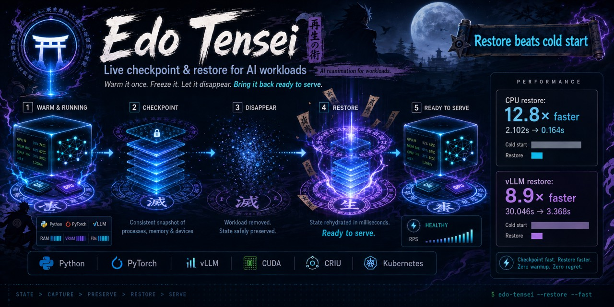

# Edo Tensei

## Live checkpoint and restore for AI workloads

Warm an AI service once, checkpoint its runtime state, and bring it back ready
to serve — without repeating the expensive model initialization path.

Edo Tensei combines process checkpoint/restore, CUDA coordination, and runtime
adapters for practical same-host recovery experiments.

### Start here

- [Get started](getting-started.md) — install dependencies and run the first CPU demo.
- [Architecture](concepts/architecture.md) — understand freeze, checkpoint, and restore.
- [Compatibility](compatibility.md) — see what is validated and what remains experimental.
- [vLLM integration](integrations/vllm.md) — restore a warmed serving process group.
- [Kubernetes integration](integrations/kubernetes.md) — run the node-local migration path.

### The core lifecycle

!!! warning "Experimental scope"
    The validated v0.1 path targets Linux x86_64, one compatible NVIDIA GPU,
    and same-host restore. Async vLLM requires the Edo CRIU fork with io_uring
    support; see the [vLLM guide](integrations/vllm.md).
