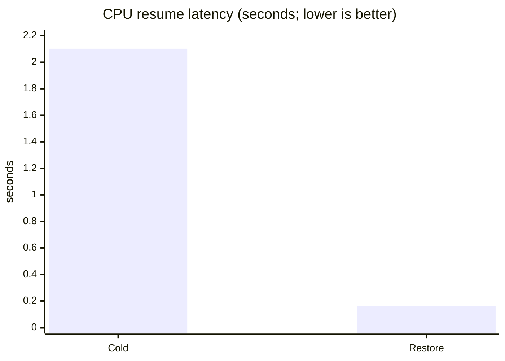

# 00 · Hello checkpoint

See the core idea in one command: start a warm CPU process, checkpoint it, simulate failure, restore it, and send a request to the restored process.

## Run

Prerequisites: Linux, Rust, Python 3, CRIU, and `sudo` permission for CRIU.

```bash
cargo run --example resume
```

Or run the script directly:

```bash
./examples/00_hello_checkpoint/run.sh
```

## Architecture, step by step


1. `workload.py` sleeps during startup, writes a warm-up event, and exposes its PID through a readiness file.
2. The script sends `SIGUSR1` once before checkpointing to prove the process is active.
3. `edo cpu-dump` records process memory and execution state; the source is then explicitly killed to model a failure.
4. CRIU restores the process and its open event file. A second `SIGUSR1` is the post-restore request.
5. A JSON report records measured cold start, checkpoint, and restore-to-request times.

## Result

The latest local run measured:

| Metric | Result |
| --- | ---: |
| Cold start to warm-up | 2.102 s |
| Restore to request | 0.164 s |
| Improvement | 12.8× |
| State after restore | request accepted |

Timings vary by host. The authoritative report is written to `.edo/runs/*-resume.json`.



## What is checkpointed?

Python heap state, signal handlers, process identity, open files, working directory, and the CRIU process image. There is no model or GPU dependency.

## Limitations and cleanup

This is a same-host CPU proof; in-flight requests and cross-host migration are not preserved. The script removes its temporary checkpoint and restored process. Reports remain in `.edo/runs/`.

Next: [01 · Stateful process](../01_stateful_process/README.md).
