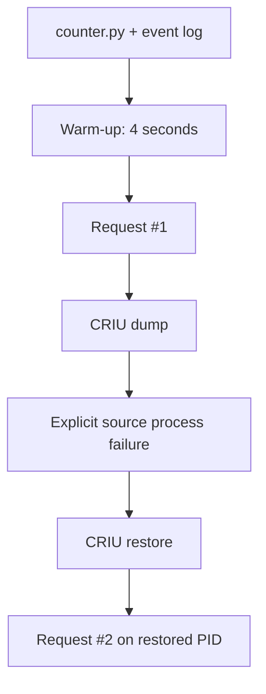

# 01 · Stateful process

Make continuity visible: the restored process handles a second signal request without rerunning its initialization.

## Run

Prerequisites: Linux, Python 3, Rust, CRIU, and `sudo` permission.

```bash
./examples/01_stateful_process/run.sh
```

The demo uses the same checkpoint engine as example 00 but gives the workload a longer four-second startup so the lifecycle is easy to observe.

## Architecture, step by step



1. `run.sh` starts the stateful fixture through the managed `edo run` lifecycle.
2. The fixture records warm-up and request events in an open JSONL file.
3. CRIU captures the Python process while it is idle between requests.
4. The source process is killed; the restored process reopens the same logical state and receives request #2.

## Result

| Check | Before checkpoint | After restore |
| --- | --- | --- |
| Warm-up | completed | not repeated |
| Request event | #1 recorded | #2 recorded |
| Process | original PID | restored PID |
| Timing | cold start is measured | restore-to-request is measured |

The JSON report is `.edo/runs/*-stateful-process.json`. Exact timings are emitted by the script, not hard-coded in this README.

## What is checkpointed?

Python memory, the counter/event state, signal handlers, open file descriptor, and process execution context.

## Limitations and cleanup

CPU-only, same-host, single process. Requests in flight are deliberately excluded. Temporary images and the restored process are removed automatically; reports remain available.

Next: [02 · FastAPI resume](../02_fastapi_resume/README.md).
