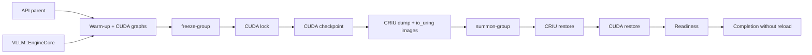
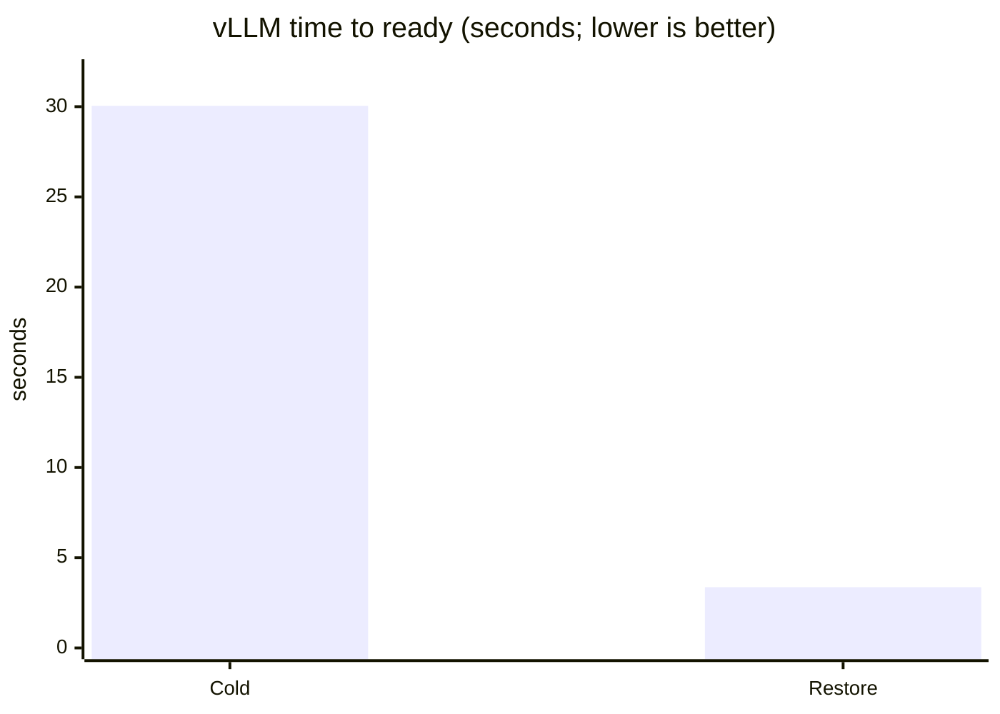

# 04 · Resume vLLM

Restore a warmed one-GPU vLLM server group — API parent plus `VLLM::EngineCore` — and answer a request without model reload, torch.compile, or CUDA-graph recapture.

## Run

Prerequisites: Linux, one NVIDIA GPU, CUDA checkpoint symbols, the project vLLM environment, cached model, the Edo CRIU fork, and a dedicated server. Read [the vLLM integration notes](../../docs/integrations/vllm.md).

> **Async requirement:** this example uses vLLM's async scheduler by default.
> Set `EDO_CRIU` to the binary built from
> [`tsdocode/criu:port-io-uring`](https://github.com/tsdocode/criu/tree/port-io-uring).
> Stock upstream CRIU is not sufficient for this async `io_uring` workflow.

```bash
./examples/04_vllm_resume/run.sh --help
```

For the destructive end-to-end test:

```bash
EDO_VLLM_COMMAND=/path/to/vllm \
./examples/04_vllm_resume/run.sh --port 18080 --full-snapshot
```

## Architecture, step by step



1. The adapter starts vLLM with tensor parallel size 1 and waits for `/health`.
2. A warm completion exercises the scheduler, torch.compile, FlashInfer, and configured CUDA graphs.
3. The request stream is drained and Edo discovers the API/engine process group.
4. `freeze-group` locks every CUDA owner before CRIU captures the process tree and io_uring descriptors.
5. `summon-group` restores the tree, restores CUDA state, waits for both owners to be `RUNNING`, and sends a completion request.

## Result

Validated Qwen3-0.6B async run:

| Metric | Cold start | After restore |
| --- | ---: | ---: |
| Ready | 30.046 s | 3.368 s |
| First warm inference | 30.080 s | 3.400 s |
| Model reload | yes | no |
| CUDA graph recapture | startup only | no |
| Completion | valid | valid |

The measured run also reported streaming TTFT of 0.040s before and 0.017s after restore. Results depend heavily on checkpoint image size, hashing mode, KV budget, and storage.



## What is checkpointed?

The tested process group, compiled runtime state, CUDA context/device state, model memory, CUDA graphs, and io_uring state. KV-cache backing is currently included in the large process/CUDA image; a separate weight/KV artifact remains future work.

## Limitations and cleanup

One GPU, same host, tensor parallel size 1. The full snapshot is destructive to the dedicated server; do not run it against production traffic. Use `--fast-restore` only for trusted local images.

Next: [05 · CUDA restore](../05_cuda_restore/README.md).
