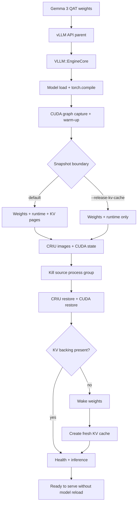

# 07 · Large vLLM Gemma QAT snapshot

This example applies Edo Tensei to a large, quantization-aware-trained Gemma
3 model served by vLLM. It is the heavyweight progression after the small
Qwen3/vLLM proof: the model remains loaded, compiled, CUDA-warmed, and ready
for restore, while the KV-cache can be released and recreated separately.

> Naming note: the published Gemma 3 instruction QAT checkpoint is a 27B
> model, not literally 31B. This example calls it “31B-class” to match the
> requested workload size and keeps the exact model ID configurable.

## What this proves

- vLLM serves a large QAT model through the OpenAI-compatible API;
- model load, torch compilation, CUDA graph capture, and warm-up happen once;
- Edo snapshots the API parent and `VLLM::EngineCore` as one process group;
- the CRIU fork records the process memory and io_uring state;
- restore does not reload the model or recapture CUDA graphs; and
- vLLM can recreate a fresh, larger KV-cache after restore when the snapshot
  boundary releases KV backing.

This is a destructive test of a dedicated server. Do not run it against a
production vLLM process.

## Hardware and software gate

The QAT model is large even after quantization. Use a GPU/node with enough
VRAM for model weights, runtime workspace, CUDA graphs, and the desired KV
cache. Multi-GPU tensor parallelism is not implemented by this wrapper; the
default path is one GPU because the current Edo process-group mapping is
single-rank.

Required:

- Linux and a CUDA-compatible NVIDIA GPU;
- vLLM with the Gemma 3 architecture and QAT quantization support;
- a Hugging Face token if the model or license requires gated access;
- the patched CRIU fork with io_uring support;
- a built `target/debug/edo` or `EDO_BIN` path; and
- enough local disk for model weights plus the checkpoint pages image.

Install the model into the normal Hugging Face cache before measuring, or set
`HF_HOME` to a persistent high-capacity volume. Model download time is not
part of the restore measurement.

## Run

Inspect the exact command and environment without launching the server:

```bash
./examples/07_vllm_gemma31b_qat/run.sh --help
```

Run the complete cold-start → warm-up → snapshot → restore → serving flow:

```bash
export HF_TOKEN=...
export EDO_VLLM_COMMAND=/path/to/vllm
export EDO_BIN=target/debug/edo
./examples/07_vllm_gemma31b_qat/run.sh --port 18087
```

Use a local model mirror or another Gemma QAT export when needed:

```bash
EDO_GEMMA_QAT_MODEL=/models/gemma-3-27b-it-qat \
EDO_GEMMA_MAX_MODEL_LEN=8192 \
./examples/07_vllm_gemma31b_qat/run.sh --port 18087
```

For the small-snapshot experiment, release KV backing before checkpointing,
restore trusted local images without re-hashing, and explicitly opt into the
experimental buffered io_uring restore path:

```bash
./examples/07_vllm_gemma31b_qat/run.sh \
  --port 18087 \
  --release-kv-cache \
  --fast-restore \
  --io-uring-restore
```

`--fast-restore` skips integrity hashing and must only be used when the
snapshot directory is protected and authenticated by the deployment. The
default command keeps verification enabled.

## Architecture



## Step-by-step lifecycle

1. The wrapper starts vLLM with the configured Gemma QAT model, one tensor
   parallel rank, bounded context length, and high GPU utilization.
2. The adapter waits for `/health`, then calls `/v1/models`, a warm completion,
   and a streaming completion to establish cold readiness, warm inference, and
   TTFT.
3. vLLM's model memory, compiled kernels, CUDA graphs, scheduler state, and
   KV allocator are now in the process group. This is the important snapshot
   point: the expensive work has already happened.
4. Edo discovers the API parent and `VLLM::EngineCore`, locks their CUDA
   owners, and invokes `freeze-group`. CRIU captures the process tree,
   descriptors, memory mappings, and io_uring rings.
5. The source process group is terminated so the restore is a real failure
   recovery rather than a second copy running beside the source.
6. `summon-group` restores CRIU first, restores CUDA state, and waits for the
   restored owners to run. With `--release-kv-cache`, the adapter then wakes
   weights and creates an empty KV cache before probing readiness.
7. The adapter sends a new completion and streaming request. It reports
   restore-to-health, restore-to-warm-inference, post-restore TTFT, and the
   TTFT delta.

## Before and after report

The script prints the measured values for the current GPU, vLLM build,
checkpoint storage, model configuration, and verification mode. Do not copy
small-model numbers into this large-model result.

| Signal | Cold start | After restore |
| --- | ---: | ---: |
| Model download | excluded when cache is warm | none |
| Model load | required | not repeated |
| torch.compile | required | not repeated |
| CUDA graph capture | required | not repeated |
| KV cache | allocated during startup | reused or recreated, depending on flag |
| `/health` | measured by script | measured by script |
| Warm completion | measured by script | measured by script |
| Streaming TTFT | measured by script | measured by script |
| Snapshot size | measured by script | same artifact |

Once a suitable GPU run is available, add its two printed timing values to a
result commit and render them as a Mermaid `xychart-beta`. Until then, the
table above deliberately avoids inventing a benchmark for hardware that has
not been exercised in this repository.

## Snapshot size and KV-cache interpretation

The full snapshot can be very large because process memory includes model
weights, allocator state, compiled runtime state, and KV pages. The
`--release-kv-cache` path uses vLLM Sleep Mode level 1 at the boundary:

1. model weights stay resident in the snapshot contract;
2. KV backing is released before CRIU hashes/captures the image;
3. after restore, weights are woken first; and
4. a fresh KV allocation is initialized before readiness is reported.

This makes the artifact smaller, but it does not preserve active conversations
or token history in KV. Existing requests must be drained before the snapshot,
and clients should retry through the serving layer after restore.

## Failure diagnosis

| Symptom | First check |
| --- | --- |
| OOM during startup | lower `EDO_GEMMA_MAX_MODEL_LEN`, reserve less KV, or use more VRAM |
| Unsupported QAT format | confirm the vLLM version and override `EDO_GEMMA_QAT_MODEL` |
| No `VLLM::EngineCore` found | inspect the process tree and vLLM multiprocessing mode |
| Restore fails on `io_uring` | use the patched CRIU fork and `--io-uring-restore`; do not mix CRIU binaries |
| Restore succeeds but API is not ready | verify CUDA unlock, then `/health` and a real completion |
| Restore is dominated by hashing | use trusted local `--fast-restore` for diagnosis only |
| Post-restore OOM with large KV | recreate KV with a lower budget or increase available VRAM |

## Cleanup and limitations

The adapter terminates the server process group on exit, but inspect the GPU
and process table after an interrupted run:

```bash
nvidia-smi
ps -ef | grep -E 'vllm|VLLM::EngineCore' | grep -v grep || true
```

This example is single-GPU, same-host, and experimental for a large QAT model.
Cross-node restore, multi-rank tensor parallelism, active KV migration,
automatic Service cutover, and production checkpoint encryption remain outside
its scope.

Next: [08 · Kubernetes migration](../08_kubernetes_migration/README.md).
