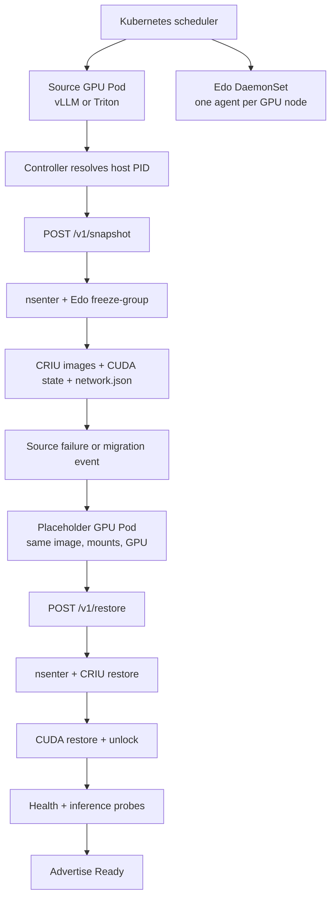
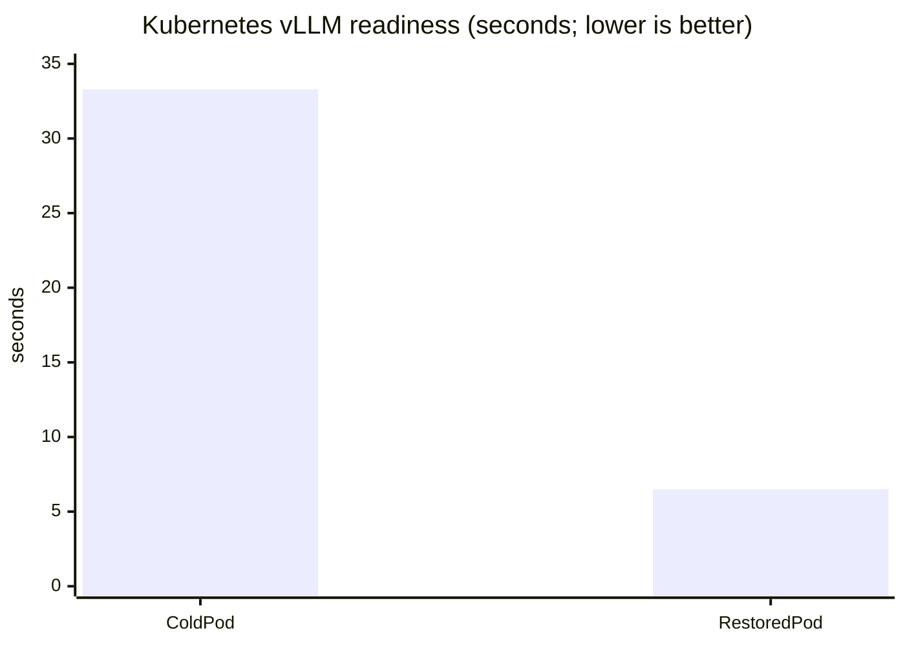

# 08 · Kubernetes migration

This is Edo Tensei's Kubernetes integration example: a node-local, privileged
snapshot agent captures a GPU workload and restores it into a same-node
placeholder Pod. It is the most complete example in this repository and the
one to read before attempting vLLM, Triton, or production orchestration.

> Important: this is an integration MVP, not a production operator. The agent
> accepts host PIDs deliberately; it does not yet discover Pods through CRI,
> upload snapshots to object storage, or manage failover automatically.

## What Kubernetes objects are involved?

| Object | File | Responsibility |
| --- | --- | --- |
| Namespace + RBAC | `namespace-rbac.yaml` | Isolates the agent and grants read-only Pod discovery permissions. |
| DaemonSet | `snapshot-agent/service.yaml` | Runs one privileged agent on every eligible node. Despite the filename, this is a DaemonSet plus its ServiceAccount. |
| Agent Service | `snapshot-agent/service.yaml` | Exposes the node-local HTTP API on port `8787`. |
| Source workload | `gpu-workload-pod.yaml` or `vllm-qwen3-pod.yaml` | Runs the process that is warmed up and checkpointed. |
| Restore placeholder | `gpu-restore-placeholder-pod.yaml` or `vllm-restore-placeholder-pod.yaml` | Supplies fresh mount/network/IPC/UTS namespaces and the GPU for restore. |
| Snapshot CRD | `edo-snapshot-crd.yaml` | Describes the future controller-facing snapshot resource; no controller reconciles it yet. |

## Why a DaemonSet?

The agent must run on the same node as the process it checkpoints. A
DaemonSet gives each GPU node a local agent with access to:

1. host `/proc`, `/run`, `/dev`, and cgroups;
2. host-visible PIDs and container namespaces;
3. the NVIDIA device and CUDA driver libraries;
4. node-local checkpoint storage; and
5. the Edo binary and the CUDA/io_uring-enabled CRIU binary.

The DaemonSet uses `hostPID: true`, `hostNetwork: true`,
`runtimeClassName: nvidia`, and `privileged: true`. These are not cosmetic
settings: without them the agent cannot map container PIDs, enter the target
namespaces, access CUDA, or ask CRIU to restore the process tree.

The current Service is mainly a convenient API surface. A production
controller should select the agent Pod on the same node as the workload rather
than sending a request to an arbitrary node.

## End-to-end architecture



### Snapshot sequence

1. Kubernetes starts the source Pod and assigns it to a GPU node.
2. The model server performs its expensive startup: model load, compilation,
   CUDA graph capture, and warm-up requests.
3. A controller or operator resolves the source container's host PID and the
   CUDA process PIDs through the CRI runtime.
4. The agent calls `edo freeze-group` from the node namespace. Edo enters the
   workload's namespaces where needed and invokes CRIU with `--leave-running`,
   `--link-remap`, `--tcp-established`, and ignored cgroup recreation.
5. CUDA state is checkpointed separately through the CUDA checkpoint API.
   CRIU records process memory, file descriptors, mappings, namespaces, and
   io_uring ring images. `network.json` records the source Pod IPv4 address.
6. The source can continue serving while the snapshot is verified or copied.

### Restore sequence

1. Create a placeholder Pod on the destination node. It must have the same
   GPU request, compatible driver/runtime, mount layout, snapshot path, and
   cache volumes. Its process only needs to stay alive so the agent can enter
   its namespaces.
2. The agent calls `edo summon-group` from the node PID namespace while joining
   the placeholder's mount, UTS, IPC, and network namespaces.
3. Edo restores the CRIU image and maps the old process tree into the new Pod.
   The placeholder's network namespace is retained because Kubernetes owns
   the veth pair and Pod IP.
4. Edo remaps accepted socket endpoints from the source Pod IP to the
   destination Pod IP, restores CUDA state, and unlocks the restored process.
5. Kubernetes must not mark the Pod Ready yet. The controller should wait for
   process liveness, `/health`, and a real inference request. This is the
   point where CUDA graph and framework readiness are verified.

## Prerequisites

- k3s or Kubernetes with `kubectl`;
- an NVIDIA GPU node and NVIDIA Kubernetes device plugin;
- compatible NVIDIA driver/CUDA versions on source and destination;
- a privileged workload policy allowing host namespaces and CRIU;
- `/opt/edo/bin/edo`, `/opt/edo/bin/criu`, and `cuda-checkpoint` on the node;
- a node-local or shared snapshot directory mounted at the same path; and
- for the vLLM path, a local model directory and persistent vLLM/Triton cache.

## Quick smoke test

From the repository root:

```bash
./examples/08_kubernetes_migration/run.sh
kubectl -n edo-system get pods -o wide
kubectl -n edo-system logs pod/edo-gpu-smoke
```

This applies the namespace/RBAC and NVIDIA smoke Pod. It validates GPU
runtime wiring only; it does not checkpoint a workload.

## Install the DaemonSet and agent

Build and publish the agent image to a registry every GPU node can access:

```bash
docker build -t ghcr.io/tsdocode/edo-snapshot-agent:dev \
  examples/08_kubernetes_migration/snapshot-agent
docker push ghcr.io/tsdocode/edo-snapshot-agent:dev

kubectl apply -f examples/08_kubernetes_migration/namespace-rbac.yaml
kubectl apply -f examples/08_kubernetes_migration/edo-snapshot-crd.yaml
kubectl apply -f examples/08_kubernetes_migration/snapshot-agent/service.yaml
kubectl -n edo-system rollout status daemonset/edo-snapshot-agent
kubectl -n edo-system get pods -l app=edo-snapshot-agent -o wide
```

The agent mounts host `/proc`, `/run`, `/dev`, cgroups, CUDA, Edo/CRIU, and
`/var/lib/edo-snapshots`. Check these before debugging the API:

```bash
kubectl -n edo-system describe pod -l app=edo-snapshot-agent
kubectl -n edo-system logs -l app=edo-snapshot-agent
kubectl -n edo-system get endpoints edo-snapshot-agent
```

## Agent API walkthrough

The MVP uses host PIDs because PID/container discovery belongs in the future
controller. A real controller should resolve these through CRI and never rely
on a hard-coded PID.

Snapshot a source workload after it is warm:

```bash
curl -X POST http://NODE:8787/v1/snapshot \
  -H 'content-type: application/json' \
  -d '{"name":"qwen3-v1","host_pid":1234,"cuda_pids":[1234,1278]}'
```

Create the placeholder, wait until its process is alive, then restore:

```bash
kubectl apply -f examples/08_kubernetes_migration/vllm-restore-placeholder-pod.yaml
kubectl -n edo-system wait --for=condition=Ready pod/edo-vllm-restore-placeholder --timeout=180s

curl -X POST http://NODE:8787/v1/restore \
  -H 'content-type: application/json' \
  -d '{"name":"qwen3-v1","host_pid":4567,"skip_integrity":true}'
```

Use `skip_integrity: true` only for trusted node-local storage when the
snapshot was authenticated at creation. Verification is safer but can dominate
restore latency for multi-gigabyte model pages.

## Validated before/after result

The same-node Qwen3-0.6B CNI test used the real vLLM server, CUDA restore, and
the port-io-uring CRIU fork:

| Stage | Before snapshot / cold Pod | After restore |
| --- | ---: | ---: |
| Pod/API readiness | ~33.3 s cold startup | ~6.5 s end-to-end restore |
| Model reload | required | none |
| CUDA restore/unlock | not applicable | ~1.6 s |
| CRIU restore | not applicable | ~4.9 s |
| Health endpoint | healthy after startup | HTTP 200 |
| Real completion | 74 ms warm request | 41 ms |
| Snapshot | not applicable | ~9.2 GiB |



The 9.2 GiB snapshot includes process memory and CRIU images. Rebuildable
vLLM/Triton compilation caches are mounted separately and reused; they are not
the same thing as KV cache. KV cache is runtime-serving state and should be
reinitialized or deliberately checkpointed according to the serving contract.

## Failure modes and diagnosis

| Symptom | Likely cause | Check |
| --- | --- | --- |
| Agent is not Ready | missing host mounts, image pull, or privileged policy | `kubectl describe pod` and agent logs |
| `PID not found` | container PID was not translated to host PID | resolve PID through CRI and `/proc/<pid>/status` |
| CRIU mount error | placeholder mounts differ from source or runtime mounts were included | compare Pod volume mounts and inspect `dump.log`/`restore.log` |
| socket restore fails | destination Pod network namespace/IP was not supplied | pass placeholder host PID and inspect `network.json` |
| CUDA restore fails | driver/GPU mismatch, missing `cuda-checkpoint`, or wrong library path | check `nvidia-smi`, `cuda-checkpoint`, and `/opt/edo/lib` |
| process is alive but not Ready | framework warm-up/health gate is missing | call `/health` and send a real inference request |
| restore is slow | integrity hashing of pages dominates | compare default verification with trusted `skip_integrity` |
| io_uring failure | CRIU binary lacks the required fork support or ring is not restorable | verify `EDO_CRIU` and inspect CRIU logs |

## Scope and next controller work

The tested MVP proves same-node restore into a Kubernetes-owned placeholder
namespace. It does not yet provide:

- automatic Pod/container PID discovery through CRI;
- a reconciler for the Snapshot CRD;
- source quiesce and destination readiness hooks;
- object-storage transfer and encryption/key lifecycle;
- cross-node GPU compatibility scheduling;
- retries, garbage collection, or node-drain orchestration; or
- automatic Service/EndpointSlice cutover.

Those pieces should be implemented by a controller around this node-local
agent. The DaemonSet remains the low-level boundary that performs privileged
namespace, CRIU, and CUDA operations.

## Cleanup

```bash
kubectl delete namespace edo-system --ignore-not-found
```

Continue with the [main README](../../README.md), or read the [architecture
guide](../../docs/concepts/architecture.md).
